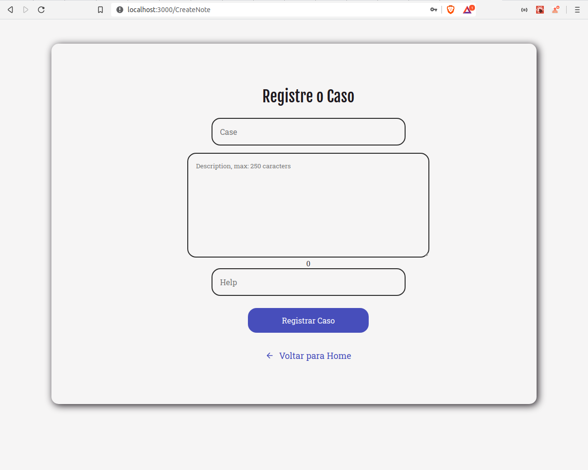

# Studying React
I made this application, just to study React and how to consume some Api that I created too.

In the App, we can Create an Account, Log in, Quit Account, Registar some Notes (That has: Case: The title, Description: Explanation of problem, Help: What would help you).

# How Can I Use ?

You will need use postgres (I use postgres in a docker).

And you will need the back-end that I created, you can find here: https://github.com/MarcusMartins38/AloneStudyindOfNode

In the back-end, run:  yarn dev:server 

Now in the front-end, to start the app, run: yarn start
