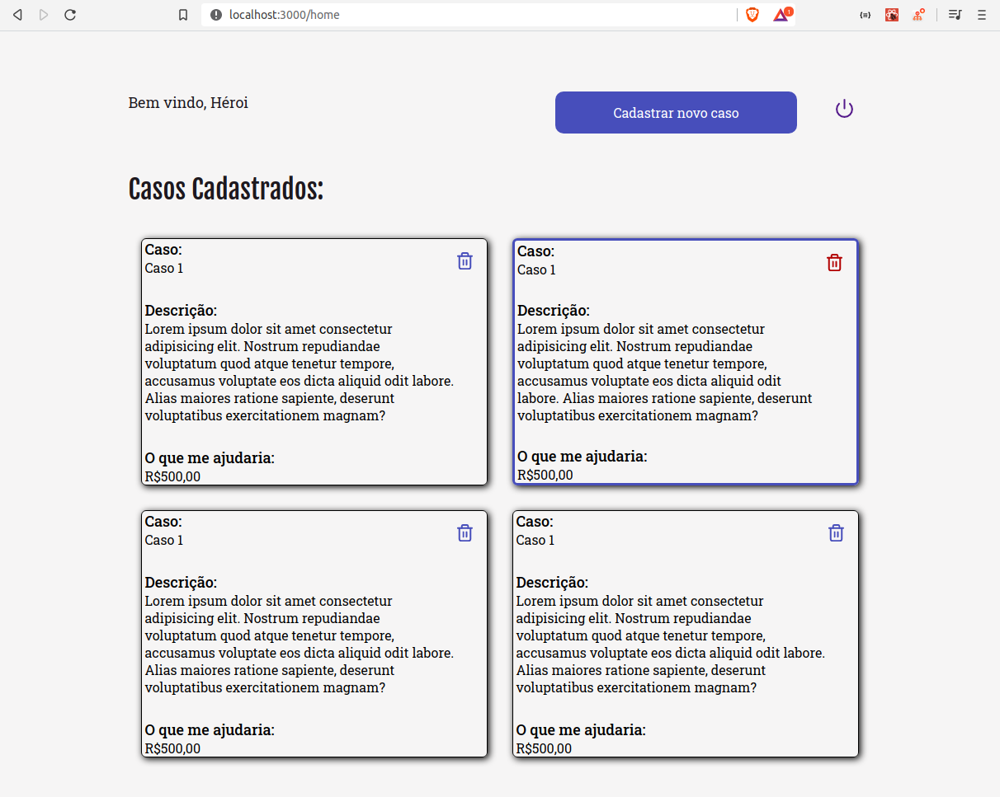

# AloneStudyingOfReact
Utilizei essa aplicação React, para estudar os components e algumas bibliotecas, como: react-router-dom , stlyed-component, polished, e entender melhor quais os momentos que devemos componentizar um elemento, visto que nem sempre e a melhor opção quando não vai ser repetido inumeras vezes, além de que, pode trazer dores de cabeça na hora da estilização, caso queira fazer uma estilização um pouco mais detalhada/complexo

A rota para /home nao está finalizada.
