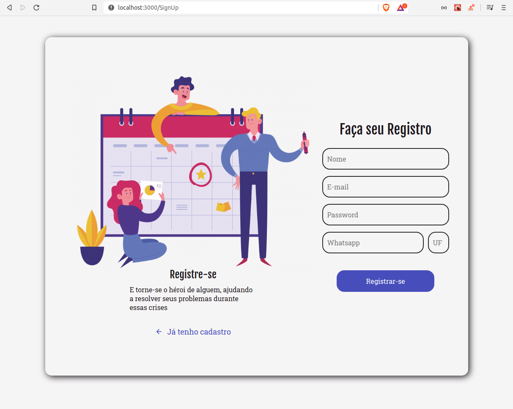

# AloneStudyingOfReact
Utilizei essa aplicação React, para estudar os components e algumas bibliotecas, como: react-router-dom , stlyed-component, polished, e entender melhor quais a componentização.

A rota para /home nao está finalizada.
